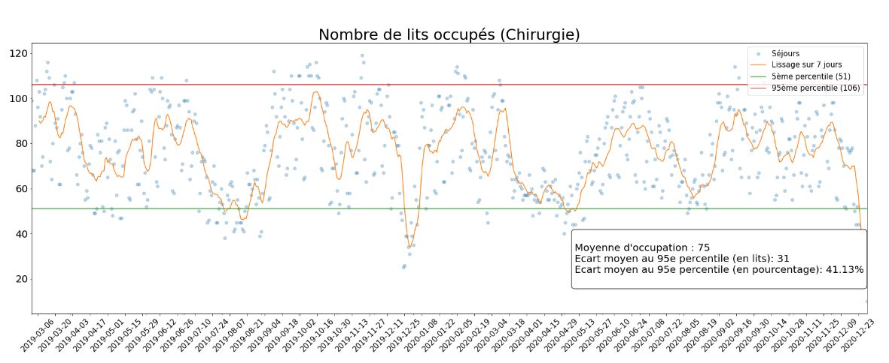
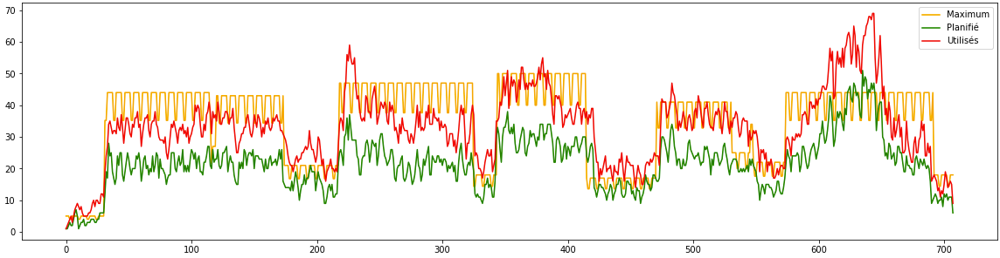

# Input HealthCare

**_Achieved in 1 week by a team of 8 in the context of a challenge of the Ecole Centrale de Lille (FR)_**

The project goal is to develop a solution to reduce the bed occupancy rate in hospitals. We have a dataset of patients (age, sex, surgical procedure, length of stay in hospital) and we have to optimize the distribution of overnight stays to reduce the occupation of beds and not exceed a target defined by the hospital.

#### Bed occupancy (from DataSet)


In this context we developed a solution in 2 main parts:
- Prediction of the number of nights for a patient based on these information : age, gender, main disease group and planned surgery
- Scheduling of appointments in accordance with the objective of the number of beds defined by the hospital and surgery slots. The result of the previous algorithm is used for the number of nights used

#### Bed occupancy (from our algorithms)

- Orange: Hospital's target nights
- Green: Planned room stays (predicted by AI)
- Red: Nights actually used (according to the DataSet)

Improvements still need to be made on the AI side to obtain a more accurate prediction and thus bring the target curve closer to the actual curve. The complexity of the algorithms should also be reviewed to speed up the time to book a surgery.

_The end of the chart is missing due to lack of time to fill the database_

## Tech Stack

To address the challenge we have split the solutions into 3 groups:

#### User Interface
 

- Appointment booking for the surgeon
- Filling the hospital bed target
- Filling the number of operations per disease category per day

#### Backend
     

- API Rest for the interface (CRUD) and to launch scripts
- Connection to the database
- Execution of scripts for scheduling a surgery at the best possible time
- API Documentation : `http://localhost:5000/doc`


#### IA Scripts
   

- Predict patient length of stay based on age, gender, planned procedure
- Calculation of the best appointment date for a surgery

## Installation

A database is required to run this project.
You need to set your database url in the `.env` file before building the project.

### Quick start using Docker

```sh
git clone https://github.com/onxzy/challenge-im
cd server
cp .env.example .env

# Set your database url at this step
vim .env 

docker compose up -d
```

### Directly on your device

1. Clone the repository
  ```sh
  git clone https://github.com/onxzy/challenge-im
  ``` 

2. Settup your environnement variables
  ```sh
  cd server
  cp .env.example .env
  vim .env
  ```

3. Build the Node server
  ```sh
  npm ci
  npm run build
  npx prisma db push
  ```

4. Install required python depedencies
  ```sh
  cd server/scripts
  python3 -m venv .venv
  .venv/bin/python3 -m pip install -r requirements.txt 
  ```

5. Start server
  ```sh
  cd server
  npm run start
  ```


## Reference

| File | Description |
| :- | :- |
| `train/` | Python Notebooks to parse the dataset and to train the AI model |
| `data/` | Dataset |
| `server/scripts/main.py` | Main script used to predict nights count and to plan surgeries |
| `server/dist/server.js`| Launch node server |
| `server/app/` | Node server source code |
| `server/prisma/` | Prisma folder (Database schema) |

